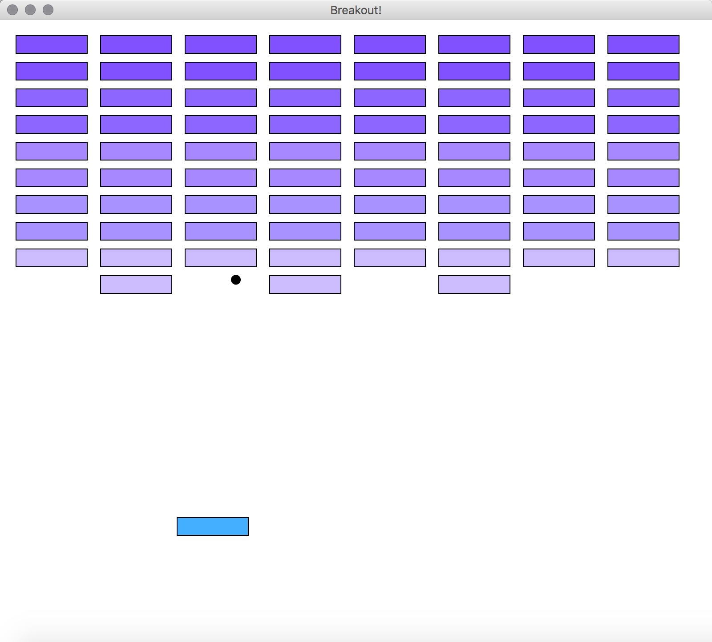
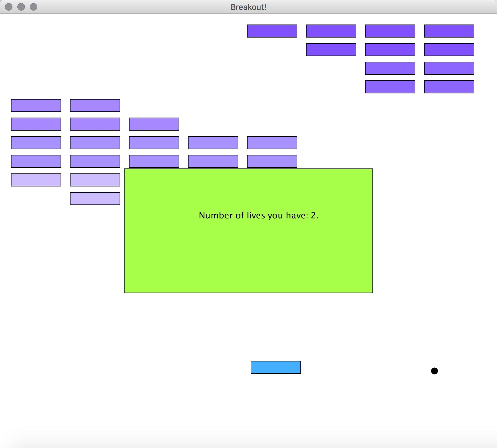
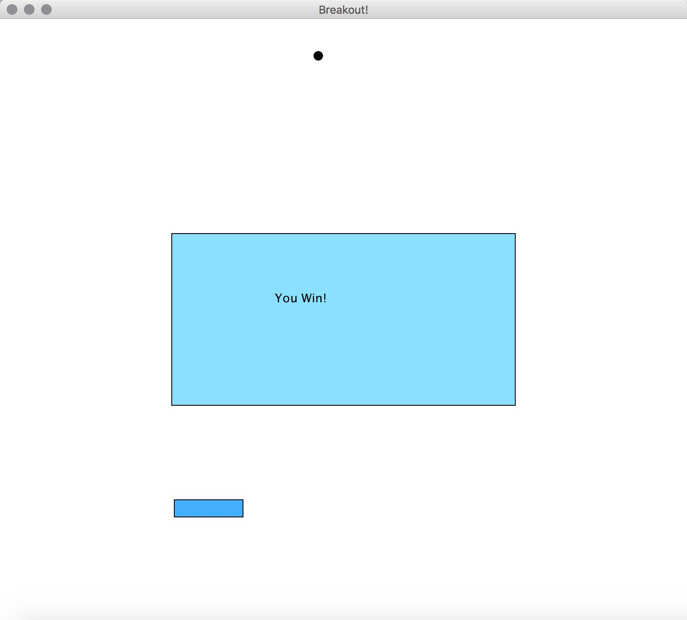

# BreakOut-Game
A game I wrote using Java for my Comp 124 Object Oriented Programming class! A user can have three turns, or lives. On each turn, a ball is launched from the center of the window towards the bottom of the screen at a random angle. That ball bounces off of the paddle and the "side walls" of the world.  

